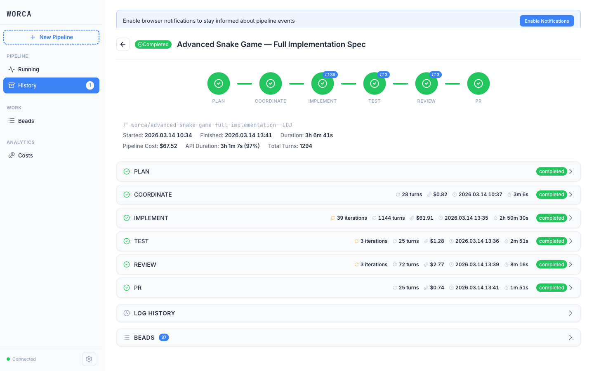
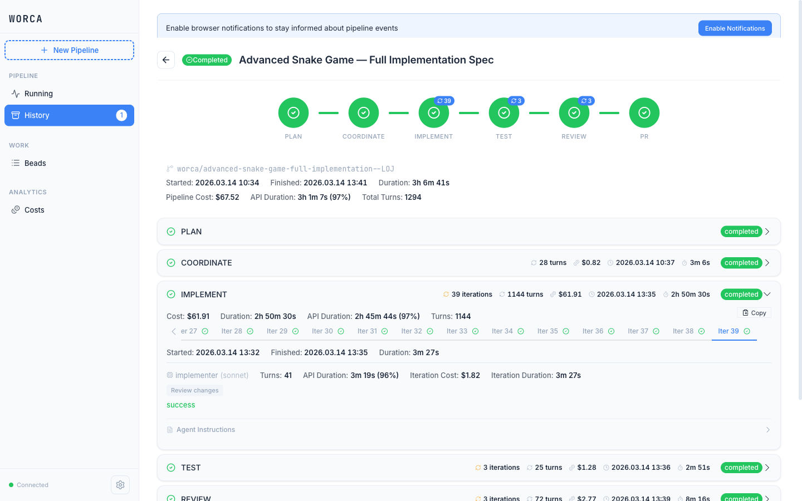
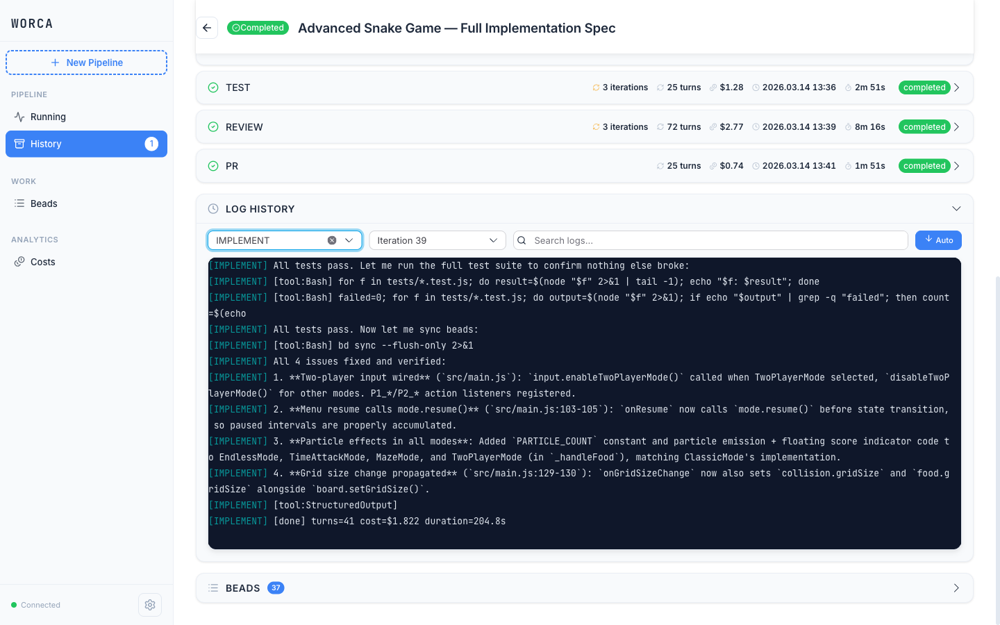
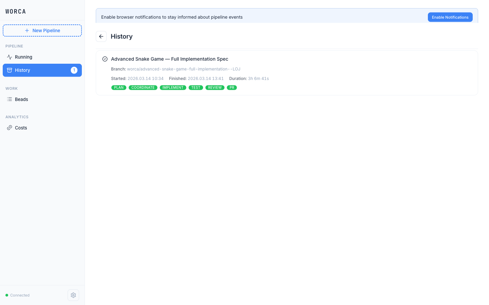
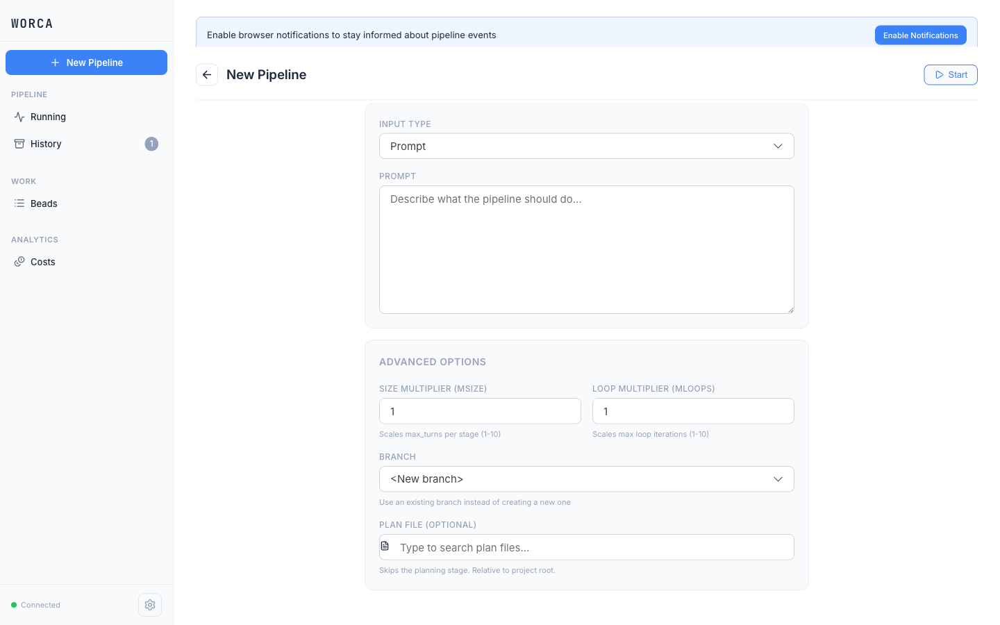
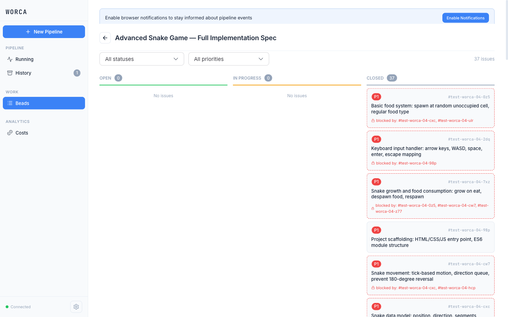
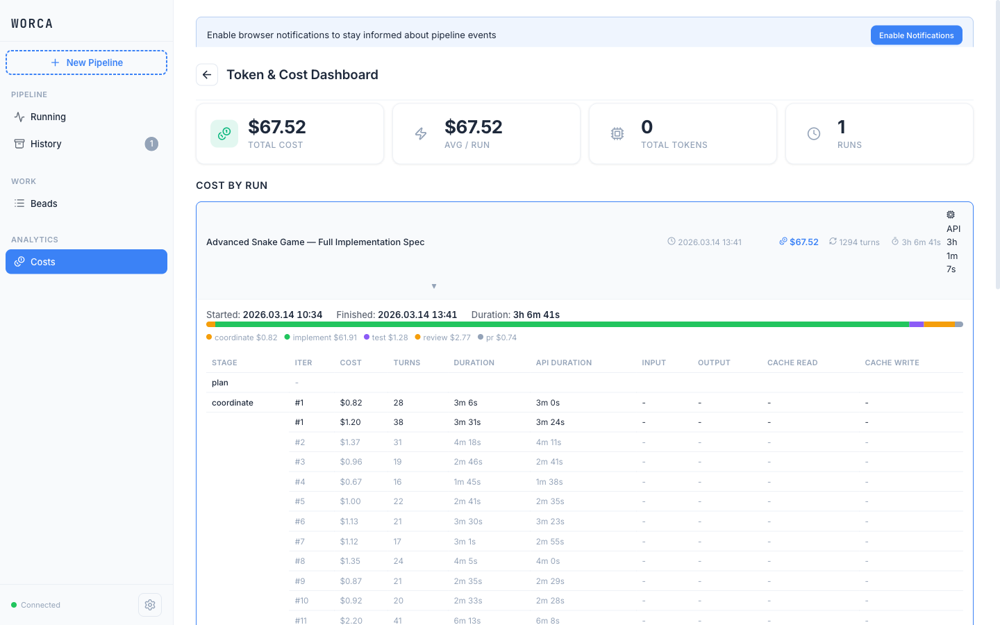
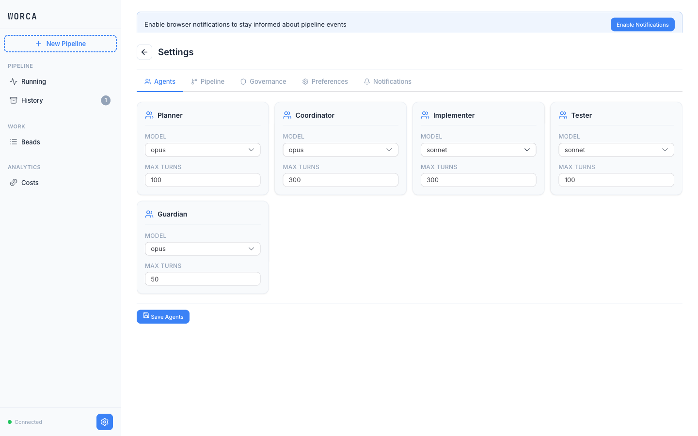

# worca-cc

Autonomous software development pipeline with governance enforcement.

worca-cc is a 5-agent pipeline that plans, coordinates, implements, tests, and reviews code changes autonomously. It runs as a `.claude/` folder you drop into any project — fully configurable, with safety hooks at every stage.

## Features

- **6-stage pipeline** — Plan → Coordinate → Implement → Test → Review → PR
- **5 specialized agents** — Planner and Coordinator on Opus, Implementer and Tester on Sonnet, Guardian on Opus (fully configurable: model and max turns per agent)
- **Governance hooks** — block dangerous operations (rm -rf, force push, env writes), enforce test gates, validate plans (fully configurable: each guard can be toggled independently)
- **Real-time dashboard** (worca-ui) — pipeline status, log viewer, settings editor, beads integration, token costs
- **Multiple work sources** — prompt, spec file, GitHub issue (`gh:issue:42`), beads task (`bd:bd-abc`)
- **Token and cost tracking** — per-agent usage with model-specific pricing (fully configurable: custom pricing per model)
- **Resume interrupted runs** — checkpoint to `status.json` and pick up where you left off
- **Loop controls** — configurable iteration limits for implement/test cycles, code review, and PR updates (fully configurable: per-loop-type limits + global multiplier)
- **Human approval gates** — optional checkpoints after planning, before merge, and before deploy (fully configurable: enable/disable per gate)

## Prerequisites

- Python 3.8+
- Node.js 22+ (for dashboard)
- [Claude Code CLI](https://docs.anthropic.com/en/docs/claude-code) (`claude` command)
- Git
- [beads](https://github.com/nightconcept/beads) CLI for task management and work coordination
  ```bash
  npm install -g @beads/bd@0.49.0
  ```
  Use version 0.49.0 specifically — later versions require Dolt DB, which is not needed for this project.

## Installation

### Using the `/install-worca` skill (recommended)

If you already have Claude Code, run inside the worca-cc repo:

```bash
cd worca-cc && claude
# Then type: /install-worca /path/to/your-project
```

This copies all pipeline files, installs dependencies, initializes beads, and stores the worca-cc source path in the target's `settings.json` for future `/sync-worca` updates.

### Manual installation

```bash
# Clone the repo
git clone https://github.com/SinishaDjukic/worca-cc.git

# Install beads CLI (uninstall any existing version first)
npm uninstall -g @beads/bd
npm install -g @beads/bd@0.49.0

# Install in your project
cp -R worca-cc/.claude/ your-project/.claude/

# Initialize beads in your project (warnings about missing hooks or
# outdated CLI are non-blocking — the pipeline works without fixing them)
cd your-project && bd init

# (Optional) Install dashboard dependencies
cd your-project/.claude/worca-ui && npm install
```

### Updating an existing installation

Use the `/sync-worca` skill to pull the latest pipeline files from worca-cc:

```bash
cd your-project && claude
# Then type: /sync-worca
```

The source repo path is resolved automatically: first from `worca.source_repo` in your project's `settings.json` (set by `/install-worca`), then by auto-detection. You can also pass an explicit path:

```bash
/sync-worca /path/to/worca-cc
```

Sync uses `rsync --delete` for core directories (worca, worca-ui, agents, hooks, scripts) to remove stale files, and additive sync for skills to preserve project-specific skills. Settings are merged — project-specific permissions, MCP config, and model preferences are never overwritten.

## Usage

Three modes of operation:

```bash
# Interactive — open Claude with pipeline hooks active
cd your-project && claude

# Autonomous — run full pipeline from prompt
python .claude/scripts/run_pipeline.py --prompt "Add user authentication"

# From spec file or pre-made plan
python .claude/scripts/run_pipeline.py --spec spec.md --plan plan.md
```

### CLI flags

| Flag | Description |
|------|-------------|
| `--prompt TEXT` | Text prompt describing the work |
| `--spec FILE` | Path to spec/requirements file |
| `--source TEXT` | Source reference (`gh:issue:42`, `bd:bd-abc`) |
| `--plan FILE` | Pre-made plan file (skips Plan stage) |
| `--resume` | Resume a previous run from status.json |
| `--branch NAME` | Use an existing branch instead of creating one |
| `--msize [1-10]` | Task size multiplier — scales max_turns per stage |
| `--mloops [1-10]` | Loop multiplier — scales max loop iterations |
| `--settings FILE` | Path to settings.json (default: `.claude/settings.json`) |
| `--status-dir DIR` | Directory for pipeline status files (default: `.worca`) |

`--prompt`, `--spec`, and `--source` are mutually exclusive — provide one.

## Dashboard (worca-ui)

```bash
cd .claude/worca-ui && npm start
# Opens http://127.0.0.1:3400
```

A real-time web dashboard for monitoring and controlling the pipeline. All updates stream via WebSocket — no polling, no page refreshes.

### Pipeline Detail

Full stage timeline with iteration counts, costs, duration, and API time. Expand any stage to see per-iteration metrics. Collapsible log viewer and linked beads panel at the bottom.



Expand a stage to drill into individual iterations — each shows agent, turns, cost, duration, and outcome.



The log viewer streams real-time agent output. Filter by stage and iteration to review past runs.



### Run History

Browse completed and interrupted runs. Each card shows the branch, timing, and stage completion badges.



### New Pipeline

Start a run from a prompt, GitHub issue, or spec file. Advanced options for size/loop multipliers, branch selection, and pre-made plan files.



### Beads Task Board

Kanban view of tasks created by the Coordinator, filtered by run. Shows priority badges, dependency chains, and status across Open/In Progress/Closed columns.



### Token & Cost Dashboard

Per-run cost breakdown with a stage-proportional bar chart. Detailed table showing cost, turns, duration, and API duration per iteration.



### Settings

Configure agent models and max turns, pipeline stages, governance rules, and notification preferences — all saved to `.claude/settings.json`.



### Development

After modifying any source files in `worca-ui/app/`, rebuild the bundle:

```bash
cd .claude/worca-ui && npm run build
```

This runs esbuild to produce `app/main.bundle.js`, which the server loads by default. Without rebuilding, changes to the source files won't take effect.

## Configuration

All configuration lives in `.claude/settings.json` under the `worca` key:

- **`worca.agents`** — model and max_turns per agent
- **`worca.stages`** — enable/disable pipeline stages, assign agents
- **`worca.loops`** — iteration limits (implement/test: 10, code review: 5, PR changes: 3, restart planning: 2)
- **`worca.governance`** — guards (block rm -rf, force push, env writes), test gate strike limit, dispatch rules
- **`worca.milestones`** — human approval gates (plan, PR, deploy)
- **`worca.pricing`** — per-model token pricing for cost tracking

## Architecture

```
Planner (Opus) → Coordinator (Opus) → Implementer(s) (Sonnet) → Tester (Sonnet) → Guardian (Opus)
```

| Agent | Model | Role |
|-------|-------|------|
| **Planner** | Opus | Reads work request, explores codebase, creates detailed implementation plan |
| **Coordinator** | Opus | Decomposes plan into beads tasks with dependencies |
| **Implementer** | Sonnet | Claims task, implements with TDD, commits code, closes task |
| **Tester** | Sonnet | Runs test suite, verifies coverage, collects proof artifacts |
| **Guardian** | Opus | Verifies test proof, reviews code, creates PR, manages human gates |

Governance hooks run at every tool call — `pre_tool_use` enforces guards and plan validation, `post_tool_use` enforces test gates and links beads tasks.

## Project Structure

```
.claude/
├── agents/
│   ├── core/           # Agent definitions (planner, coordinator, implementer, tester, guardian)
│   └── domain/         # Custom domain-specific agents
├── hooks/              # Claude Code lifecycle hooks
│   ├── pre_tool_use.py
│   ├── post_tool_use.py
│   └── ...
├── scripts/
│   ├── run_pipeline.py # CLI entry point
│   ├── run_parallel.py # Parallel batch execution
│   └── run_batch.py    # Batch runner
├── worca/
│   ├── orchestrator/   # Pipeline runner, stages, resume, prompt builder
│   ├── hooks/          # Guard, plan_check, test_gate, tracking
│   ├── schemas/        # JSON schemas for agent outputs
│   ├── state/          # Status persistence
│   └── utils/          # Git, beads, Claude CLI, token tracking
├── worca-ui/
│   ├── server/         # Express + WebSocket server
│   ├── app/            # Lit-HTML frontend
│   └── bin/            # CLI launcher
├── skills/             # Custom skills
└── settings.json       # Configuration
```

## Testing

```bash
# Python tests
pytest tests/ -v

# UI server tests
npx vitest run .claude/worca-ui/server/
```

## License

[MIT](LICENSE)
