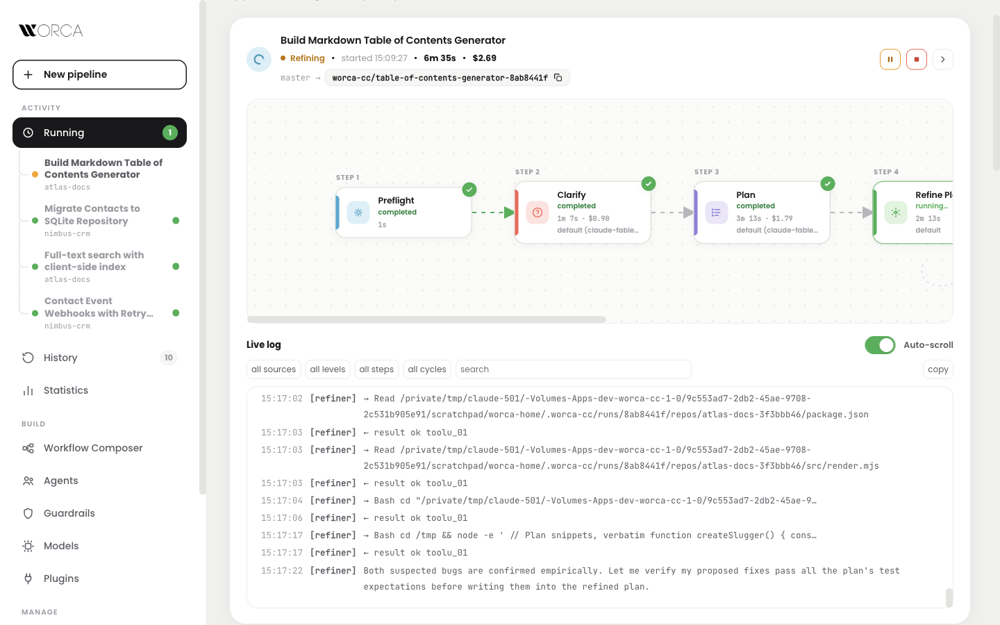
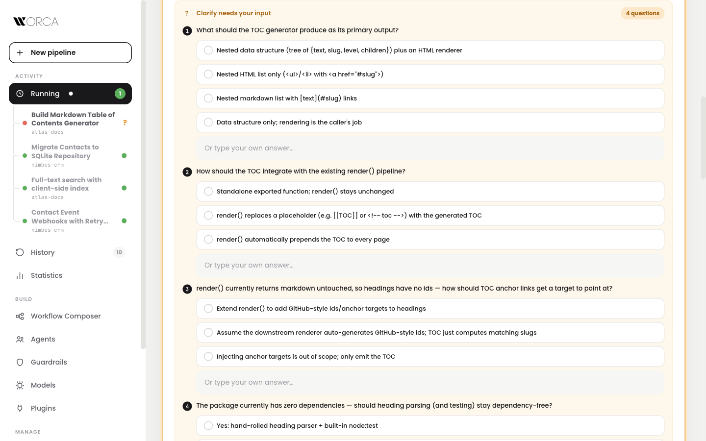
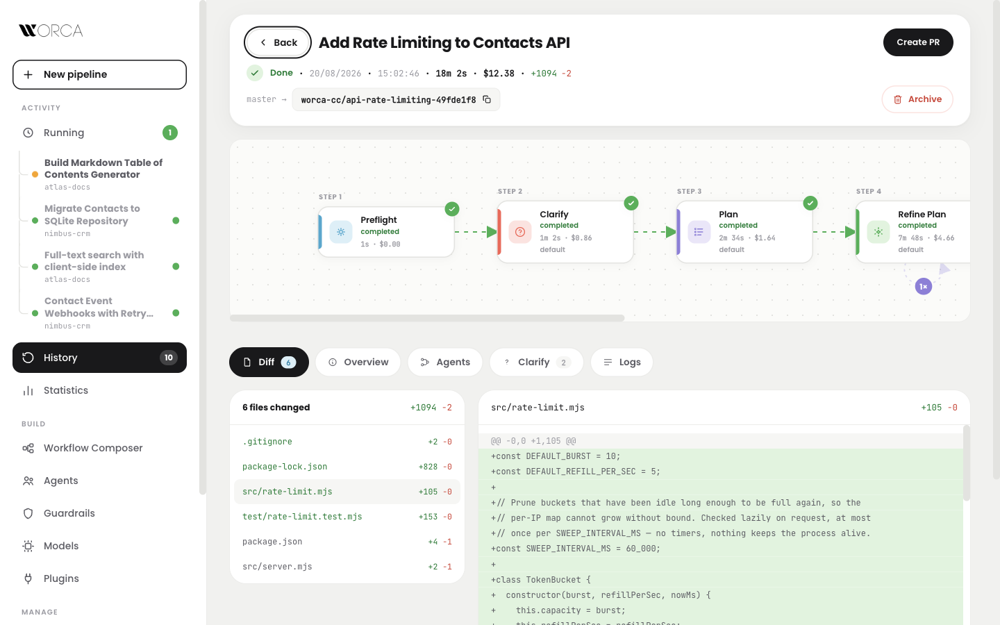
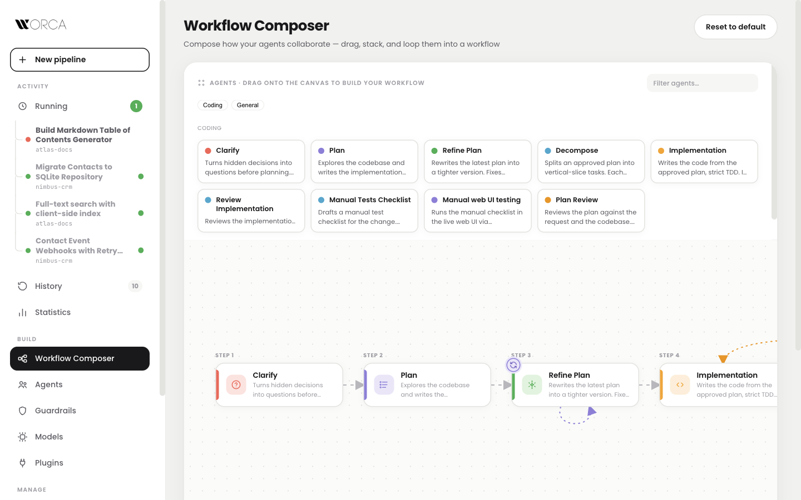
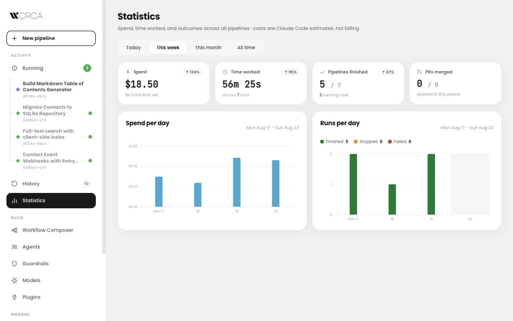
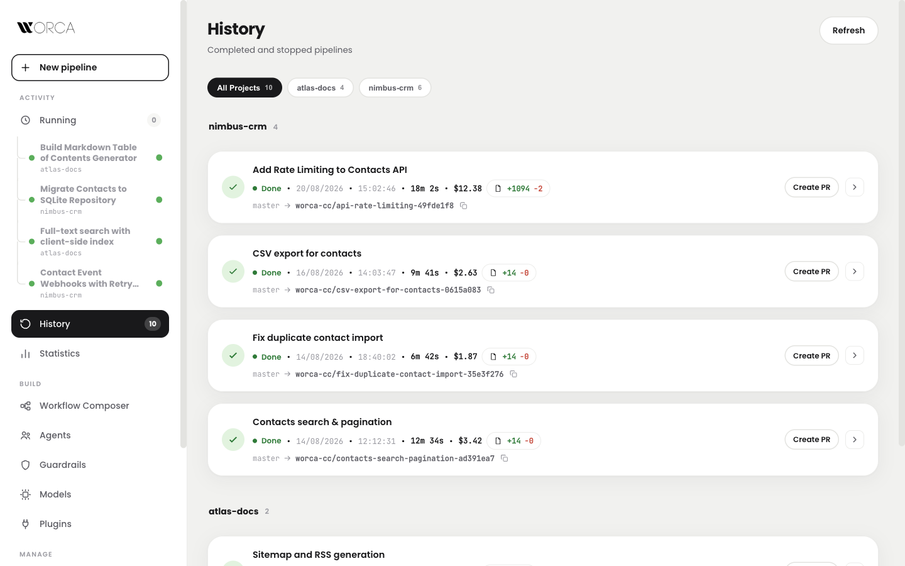

# Worca

[](https://www.npmjs.com/package/@worca/app)
[](LICENSE)
[](.nvmrc)

Worca is a **deterministic multi-agent pipeline** that drives Claude Code
(headless) through **Plan → Refine → Implement → Review** for a software task.
You point it at a project, describe the work, and a state machine runs the
agents of your chosen workflow in sequence — looping until the work clears
quality gates, pausing to ask *you* the questions that matter, and keeping
every run isolated in its own git worktree and branch.

It ships as a **web UI**, a **CLI**, and an installable **`/worca` skill** for
Claude Code — all running the same engine. See the
**[architecture in one picture](docs/ARCHITECTURE.md)**.



## How a run works

1. **Clarify** — instead of assuming, the planner turns hidden decisions into
   multiple-choice questions (2–4 options plus free text). Your answers are
   appended to the plan so reviewers see them.
2. **Plan** — the planner explores the codebase and writes an implementation
   plan with concrete code snippets.
3. **Refine** — the refiner reviews and rewrites the plan (`-v2`, `-v3`, …)
   until no critical/major issues remain.
4. **Implement** — the implementer follows the approved plan with no
   deviation, using TDD (red-green-refactor).
5. **Review** — the code reviewer reviews the git diff and hands blocking
   findings back to the implementer, looping Implement → Review until clean.

Loops gate to you past their cycle cap (default 3): approve another cycle or
continue with the open issues shown. Only `critical`/`major` findings block; a
finished run ends on its own branch, one click away from a PR.



Every finished run keeps its full record — the diff per file, per-step costs
and durations, the clarify Q&A, agent transcripts, and logs:



## Features

### Pipeline

- **Deterministic engine** — a state machine sequences the agents; agents do
  the creative work, the engine does the control flow. Every step, verdict,
  and artifact is recorded.
- **Pause & resume, even across restarts** — pause mid-run (or hit a cost
  cap); resume later re-attaches the interrupted Claude sessions
  (`claude --resume`), surviving server restarts. Worktrees and uncommitted
  agent work are kept.
- **Isolated worktrees** — each run works on its own git worktree and feature
  branch; your checkout is never touched, and parallel runs don't collide.
- **Live cockpit** — flow graph per run, streaming log with source/level/
  step/cycle filters and search, per-run cost and elapsed time, compact and
  detailed densities.
- **One-click PRs** — a finished run shows its diff (files, +/−) and opens a
  pull request via `gh` from the History view.
- **Mock mode** — the entire pipeline runs offline with a deterministic mock
  (no `claude`, no tokens) for demos, development, and CI.

### Agents

- **11 data-driven agents** — planner, plan refiner, plan reviewer,
  implementer, code reviewer, clarify, decomposer (splits a plan into
  vertical-slice tasks, one implementer each), manual-tests checklist, manual
  web-UI testing (drives a browser via Playwright), workspace scanner, and
  workspace reviewer. Each agent is a markdown prompt plus a metadata sidecar
  — new agents drop in without engine changes.
- **AI-assisted agent creation** — describe a new agent in the UI and Worca
  generates both its system prompt and metadata (or paste your own prompt and
  let it infer just the wiring); edit, regenerate, and save.
- **Per-agent model & effort** — pick model and reasoning effort per agent,
  per workflow, or per run, with a clear resolution order and "save as
  workflow defaults".

### Workflow Composer

- **Compose your own pipeline** — drag agents onto a canvas to build
  sequential steps, parallel groups, and feedback loops (an agent that emits
  a verdict can loop back to an earlier step until it passes or hits its
  cycle cap). Saved workflows appear in the New Pipeline picker; **Reset to
  default** redraws the standard Plan → Refine → Implement → Review.



### Guardrails

- **Named policy sets, selected per run** — built-in **Permissive / Normal /
  Strict** tiers plus your own sets. Normal protects credential files and
  blocks publication commands; Strict adds environment scrub on agent spawn,
  network-egress and cloud-CLI denies, and home-dir credential protection.
- **Enforced via Claude Code permissions** — policies compile to
  `permissions.deny` rules on every agent spawn; repo settings can't undo
  them. See [`docs/guardrails.md`](docs/guardrails.md) for the full model and
  its honest limitations.

### Workspaces

- **Multi-project runs** — group related repos into a workspace; a scanner
  maps how they interconnect (shared APIs, schemas, build deps) into an
  editable description, and a workspace run fans the pipeline out across all
  members — one branch and worktree per member, one cross-project review
  verdict at the end.

### Plugins & chat

- **Plugin system with marketplaces** — plugins contribute task sources
  (e.g. GitHub Issues), agents, skills, workflow templates, models, and chat
  channels. Install from a marketplace with an explicit consent ceremony
  (what's installed, which secrets are required, which setup commands run);
  updates show a commit-level preview before you accept.
- **Drive runs from chat** — bundled two-way **Telegram**, **Slack**,
  **Discord**, and **Microsoft Teams** channels: get notified on questions,
  finishes, failures, and cost pauses, and answer back with commands —
  `/status`, `/cost`, `/answer`, `/approve`, `/pause`, `/resume`, `/stop`,
  and more — with allowlist-based authorization.

### Costs & budgets

- **Cost tracking everywhere** — per-run and per-step cost estimates, a
  Statistics view with spend/time/outcome charts per day, week, or month, and
  a spend indicator in the sidebar.
- **Hard limits** — a per-pipeline cost cap pauses a runaway run (resumable
  with an explicit override); a total budget pauses everything and blocks new
  runs until the weekly or monthly window resets.



### Models

- **Bring your own models** — register any model id (a proxy, a fine-tune, an
  alternative provider), declare which effort levels it supports, and attach
  per-model routing environment (e.g. `ANTHROPIC_BASE_URL`) that is merged
  into that model's agent spawns. Share a model catalog as a plugin, with
  secrets required at install time.

### Storage

- **Nothing in your repo** — run state lives in one SQLite database
  (`~/.worca-cc/worca-cc.db`), plan/review markdown in a machine-wide store
  keyed by repo identity (stable across worktrees). The **History** view
  spans every project on the machine. See
  [`docs/storage.md`](docs/storage.md).



## Install

```bash
npm install -g @worca/app
```

Requirements:

- **Node.js >= 22.13.0** (the built-in `node:sqlite` store)
- The **[Claude Code](https://docs.anthropic.com/en/docs/claude-code) CLI**
  (`claude`) on your `PATH` — for real runs; mock mode needs nothing

## Quick start

### Web UI

```bash
worca --ui
```

Open the printed URL (default `http://localhost:4317`), add a project, and
click **New pipeline**: describe the task (or paste a markdown brief, or pull
a task from a plugin source like GitHub Issues), pick a workflow and
guardrails, and run. Answer clarify questions and loop gates as they come —
in the browser or from chat.

### CLI

```bash
# run a pipeline against a project
worca --project /path/to/your/project --prompt "Add a /search endpoint"

# use a markdown brief as the prompt
worca --project /path/to/your/project --file ./brief.md --title "Search feature"

# pause with Ctrl+C, continue later (survives restarts)
worca resume <pipelineId>

# offline demo — full pipeline, no tokens
worca --project /path/to/your/project --prompt "demo task" --mock --yes
```

Run `worca --help` for all subcommands (projects, plugins, marketplaces,
config, doctor) and flags.

### `/worca` skill (inside Claude Code)

```bash
worca --install /path/to/your/project
```

Then open Claude Code in that project and run:

```
/worca Add a /search endpoint with pagination
```

The skill starts the same deterministic orchestrator.

## Documentation

- [Architecture](docs/ARCHITECTURE.md) — the whole stack in one picture
- [Guardrails](docs/guardrails.md) — policy model, enforcement, limitations
- [Storage](docs/storage.md) — where state lives, project keys, migration
- [Releasing](docs/RELEASING.md) — how `@worca/app` versions are published
- [Contributing](CONTRIBUTING.md) — developing Worca from source

## Contributing

Bug reports and PRs are welcome — see [CONTRIBUTING.md](CONTRIBUTING.md) for
the from-source setup, the test suite, and the PR workflow. Development
happens on the `dev` branch.

## License

[MIT](LICENSE)
