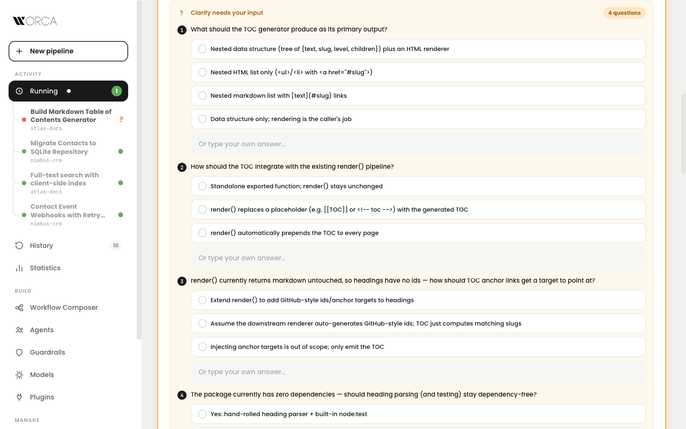
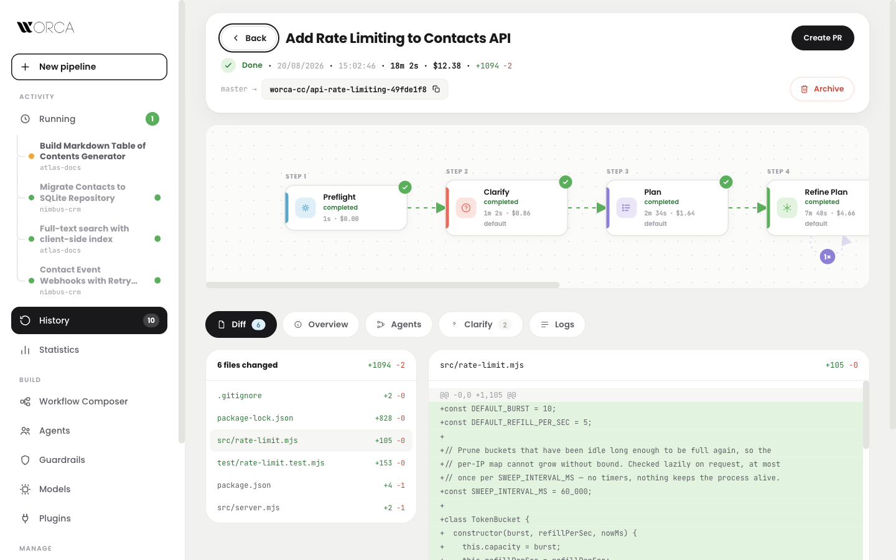
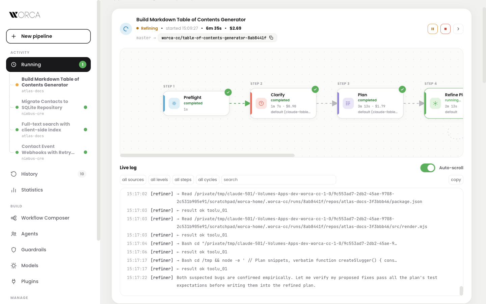
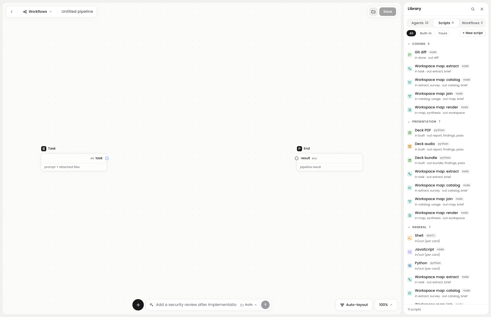
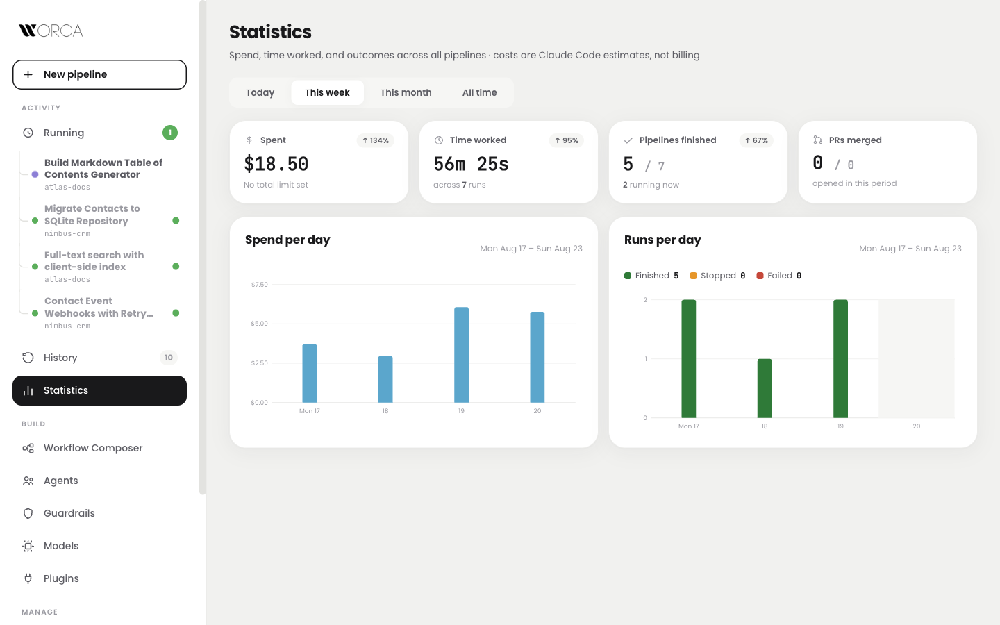
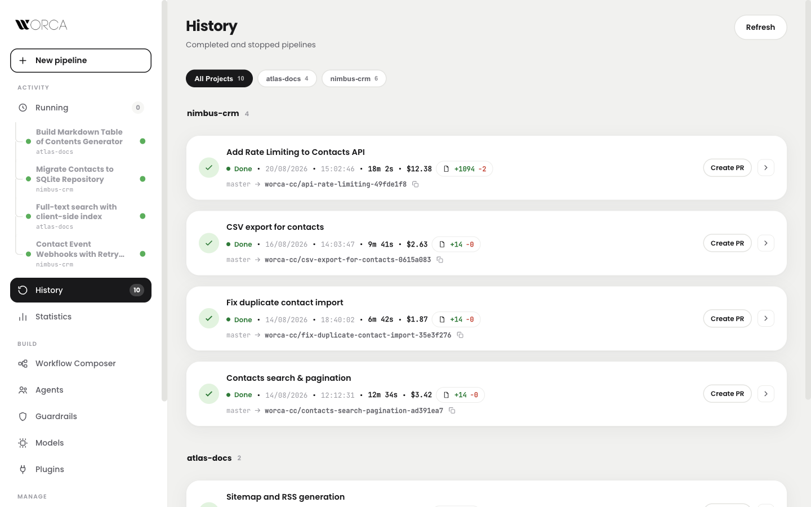

# Worca

[](https://www.npmjs.com/package/@worca/app)
[](LICENSE)
[](.nvmrc)

Worca turns a task into **reviewed, merge-ready work**. It is a
**deterministic multi-agent pipeline**: you point it at a project, describe the
work, and a state machine runs the agents of a workflow in sequence — by
default **Clarify → Plan → Refine → Implement → Review** — looping until the
work clears quality gates, pausing to ask *you* the questions that matter, and
keeping every run isolated in its own git worktree and branch. Pick **Auto**
and Worca chooses the workflow for the task, draw your own in the **Workflow
Composer**, or start the shipped **Presentation** workflow to turn a brief into
a slide deck.

It ships as a **web UI**, a **CLI**, and an installable **`/worca` skill** for
Claude Code — all running the same engine — and chat plugins (Telegram, Slack,
Discord, Teams) let you drive runs from a chat. See the
**[architecture in one picture](docs/ARCHITECTURE.md)**.

[](docs/ARCHITECTURE.md)

## How a run works

Pick **Auto** — first in the New pipeline **Workflow** picker and selected by default
(`--workflow auto` on the CLI) — and Worca picks the workflow for you. One model call
reads the task text, the attached files and a small offline fingerprint of the
repository (and may take a brief read-only look at the checkout), then classifies the
task: a free-form prompt, a partial plan or a complete plan, how large the change is,
and signals such as a big web UI feature. It knows every agent only by its metadata
and the front matter of its agent file (never the agent's full instructions) and
assembles a matching workflow from those agents. A saved workflow with exactly that
shape is reused; otherwise the proposal is saved as a new workflow once accepted. With
**Human in the loop** on (the default), you see the proposal first: **Accept & run**,
**Revise** it in plain text (Advanced and up), or **Cancel run**. Turn the switch off
(`--no-human`) and the proposal is accepted as is, with no clarify step and no agent
questions; a loop that runs out of cycles, a recovery prompt, a cost cap or an error
still pause the run. Pick any saved workflow instead to skip all of this. Auto is not
available for workspace runs yet.

The built-in **Default** workflow hands your task to five agents:

1. **Clarify** — instead of assuming, a Clarify agent turns hidden decisions into
   up to 8 multiple-choice questions (2–4 options plus free text, optionally with a
   recommended pick), and asks none when the task is clear. The planner records your
   answers in the plan's `## Clarifications (Q&A)` section, so every later step
   sees them.
2. **Plan** — the planner explores the codebase and writes an implementation
   plan with concrete code snippets.
3. **Refine Plan** — the refiner reviews and rewrites the plan (`-v2`, `-v3`, …)
   until no critical/major issues remain.
4. **Implementation** — the implementer follows the approved plan with no
   deviation (recording any it is forced into), using TDD (red-green-refactor).
5. **Review Implementation** — the code reviewer reviews the git diff against the
   plan and hands blocking findings back to the implementer, looping Implement →
   Review until clean.

Each loop has a cycle cap (default 3, adjustable per loop). A loop that hits it with
blocking findings left pauses the run and lists the open issues: **I approve another
cycle**, or **Don't approve another cycle and continue** with what you have. Only
`critical`/`major` findings block; `minor` findings and suggestions never do. A
finished run's work is committed to its own `worca-cc/…` branch, ready for
**Create PR**.



Every finished run keeps its full record, one tab each in **Runs**: **Overview**
(the review verdict and its findings, time, cost, files changed), **Diff** (every file with its +/− and patch),
**Artifacts** (the plans, reviews and other files the steps wrote), **Actions**,
**Workflow** (the graph as it ran, with per-step time and cost at Expert), **Q&A**
(the clarify answers and any mid-run questions), and at Expert **Logs** and
**Agents**. Diff, Artifacts and Actions start at Advanced (see
[UI levels](docs/ui-levels.md)).



## Features

### Pipeline

- **Deterministic engine** — a scheduler walks the workflow graph and decides
  what runs next; agents do the creative work, never the control flow. Every
  step, verdict, cost and artifact is recorded
  ([architecture](docs/ARCHITECTURE.md)).
- **Pause & resume, even across restarts** — **Pause** parks a run, and so does
  a cost cap or a failing step; only **Stop** ends one. **Resume** re-attaches
  the paused Claude sessions (`claude --resume`) in the same worktree,
  uncommitted agent work included, or **Resume at…** schedules it. Paused runs
  survive a server restart, and a run cut off mid-step comes back as
  *Interrupted*, resumable from its last clean point.
- **Isolated worktrees** — each run works in its own git worktree on its own
  `worca-cc/…` branch, so agents never edit your checkout and parallel runs
  don't collide. When a run ends, its work is committed to that branch and the
  worktree is removed; the branch stays.
- **Live cockpit** — **Runs** in the sidebar lists every run, live and
  finished, with **All / Live / Finished / Needs you** tabs, search, and
  grouping by project or date. A live run's page shows its state and current
  step, ticking time, cost and changed files, and a **Live view** of the running
  step inside its workflow graph; **Diff** shows the worktree's changes so far,
  and **Logs** streams every step with search (filters by source, level, step
  and cycle at Expert).
- **One-click PRs** — a finished run's page offers **Create pull request**:
  *Ship it?* shows the files and +/− lines, lets you write the description or
  **Generate with AI**, then pushes the branch and opens the PR with the GitHub
  CLI (`gh`), or on [Azure DevOps](docs/azure-devops.md) with a personal access
  token. The button then becomes **View pull request**.
- **Mock mode** — the **Mock mode** switch on New pipeline (`--mock` on the
  CLI, `WORCA_MOCK=1` for a whole server) runs the pipeline against a
  deterministic offline mock — no `claude`, no tokens — for demos, development
  and CI.



### Agents

- **22 built-in agents, all data** — each is a markdown prompt plus a
  metadata sidecar declaring its typed input/output ports, so a new agent
  drops in without engine changes; your own and plugin agents load the same
  way.
  - *Coding* — Clarify, Plan, Refine Plan, Plan Review, Decompose (splits a
    plan into vertical-slice tasks, one implementer each), Implementation,
    Review Implementation, Manual Tests Checklist, and Manual web UI testing
    (runs that checklist in a browser via Playwright).
  - *Workspaces* — Workspace Review (one review per changed project, one
    cross-project verdict) and the workspace scan's Workspace Survey,
    Workspace Usage and Workspace Synthesis, which only the scan can place.
  - *Presentations* — Deck Clarify, Narrative Spine, Visual System, Deck
    Builder, Deck Audit, Deck Review, Deck Outputs, Deck Export.
  - *Memory defragment* — restructures one memory scope.
- **Agents page** — **Build › Nodes › Agents** (Expert) lists every agent
  with its ports; built-ins are read-only, so **Duplicate** one to get an
  editable copy ([docs/ui-levels.md](docs/ui-levels.md#agents-page-e)).
- **AI-assisted agent creation** — **Create agent** (or **Create agent…** in
  the composer): give a name, a purpose and a description and Worca drafts
  both the system prompt and the metadata, or paste your own prompt and let it
  infer just the wiring; edit the draft, **Regenerate**, **Save agent**.
- **Ask forms** — an agent that needs a human can declare the form its
  question is asked with: JSON in its sidecar, drawn by Worca from a fixed
  widget catalog (galleries, rankings, per-item review lists, previews of the
  files it just produced) and validated by the server on the way back. The CLI
  and chat get a text projection (chat answers with `/answer field=value`); a
  finished run's page replays the form read-only with its answer. Review
  Implementation, Narrative Spine, Visual System and Deck Outputs ask this way;
  plugins can ship forms too.
- **Per-agent model & effort** — pick a model and reasoning effort (medium,
  high, xhigh, max) per agent node: in the composer's **Info** pane for the
  workflow, or in New pipeline › **Advanced** › **Agents** for one project,
  kept for its later runs (**Save as workflow defaults** moves them into the
  workflow). A project pick beats a team-policy default, which beats the
  workflow's own; `--model` only fills nodes with none. Fan-out agents also
  take a sub-agent model.

### Scripts

- **Cards that run your own program** — a script card keeps the whole outside of
  an agent card (typed ports, verdict routing, loops) and replaces the inside
  with your own Node.js, Shell or Python program (Python when the host has an
  interpreter), so a test gate or a transform costs no model call. See
  [docs/scripts.md](docs/scripts.md).
- **The Scripts page** — **Build › Nodes › Scripts** (Expert) lists every
  built-in, own and plugin script with its runtime and ports. **New script**
  picks a runtime, then reads the ports and params from the code as you type;
  **Duplicate** copies any script into your own folder; **Delete** refuses while
  a saved workflow still places it. Built-in and plugin scripts open read-only.
- **Test bench** — under the editor, runs one script by itself, even an unsaved
  draft, with hand-filled params and inputs through the very same runner a
  pipeline run uses. **Save as case** keeps the setup with an optional
  expectation (verdict, fired ports, summary text); **Run all** re-runs every
  case.
- **Shipped scripts** — Shell, JavaScript and Python cards, Git diff, and the
  steps behind the presentation and workspace-map workflows come built in.
  Plugins can ship scripts and test cases of their own.



### Workflow Composer

- **Compose your own pipeline** — **Build › Workflow Composer** (Advanced) is a
  canvas: click or drag a card from the palette and wire its typed ports
  (`md`, `json`, `void`). Each card declares what it consumes and produces, a
  wire only connects compatible ports, and **Save** stays off until the graph
  is valid. A blocking output wired back to an earlier card becomes a loop
  (drawn amber): a reviewer keeps sending work back until it passes or the
  loop hits its cycle cap — 3 by default, set per loop wire in Expert mode.
  Flow cards — **Task** (the run's request), **End** (the result) and, in
  Expert, **AND**, **OR**, **Combine** — express joins, choices and merges
  without any code. See [`docs/ui-levels.md`](docs/ui-levels.md#workflow-composer-page-a)
  for what each level shows.
- **Saved pipelines** — the list under the canvas is tabbed by domain; click a
  card to open it. The built-in **Default** and **Memory defragment** open
  read-only (Save makes a copy). Saved pipelines are offered in New pipeline's
  **Workflow** picker, and so in schedules.
- **Share a pipeline** — **Export…** on a saved card offers three formats.
  A **JSON file** carries the graph only; the recipient picks it up with
  **Import…** (a taken name gets a ` (2)` suffix; nothing is ever overwritten,
  and any script commands are shown for approval first). In Expert, a
  **Claude Code skill** writes a `SKILL.md` plus the agents it dispatches
  under `.claude/`, so the pipeline runs inside Claude Code without Worca
  (not yet for pipelines with script cards). A **Worca plugin** folder
  bundles the pipeline with your own agents and scripts it uses and the
  skills they need — built-in agents are never copied — so the recipient runs
  `worca plugin link <folder>` and picks up edits with
  `worca plugin reimport <name>`. The CLI does the same with
  `worca workflow list`, `worca workflow export <id> --format json|claude|plugin`
  and `worca workflow import <file>`.


### Presentations

- **From a brief to a slide deck** — the built-in **Presentation** workflow
  turns a request into a deck: pick it in New pipeline's **Workflow** picker
  (Advanced; Simple lists only Auto and Default), have Ask Worca propose one,
  or run `worca --workflow wf_presentation --prompt "…"`. Deck Clarify asks
  what shapes the talk (live or read alone, audience, duration, the ask,
  sources, brand); Narrative Spine writes one hallway sentence, a 3–5 section
  spine and a takeaway title per slide; Visual System fixes grounds, type
  scale, compositions and the accent, with rendered preview sheets. You approve
  the spine and the system on ask forms or send changes back, and Deck Outputs
  asks what to deliver (PDF + standalone HTML, PDF only, standalone HTML only,
  or the deck files only) and whether to add narration audio.
- **Built, measured, reviewed** — Deck Builder writes a 1920×1080 HTML deck on
  the vendored OpenDeck kit, one section per slide. Deck Audit renders it
  headless, screenshots every slide and reports mechanical facts (boxes
  escaping the slide, clipped or overlapping text, contrast, text size, words
  per slide); once that is clean, Deck Review judges the rendered slides
  (focal points, takeaway titles, one hero moment). Findings go back to the
  builder, up to 3 cycles each.
- **Files you can send** — after a clean review, script cards print `deck.pdf`
  with headless Chrome (page count checked against the slide count),
  optionally record a per-slide ElevenLabs narration from the speaker notes
  (the API key is used for that run only, never written to disk), and inline
  everything into one self-contained `deck.standalone.html`; Deck Export then
  checks the result against what the request asked for. Their findings loop
  back to the builder too, up to 2 cycles. The files live in the run's folder,
  not your repository — open them on the run's **Artifacts** tab (Advanced).
  The audit and the PDF need Chrome, Chromium or Edge; the script cards need
  Python 3.8+. The narrated deck linked from
  [`docs/why-worca.md`](docs/why-worca.md) runs on the same kit.

### Guardrails

- **Named policy sets, picked per run** — the **Guardrails** picker under
  **New pipeline › Advanced** offers the built-in **Permissive / Normal /
  Strict** tiers plus your own sets; Permissive, the default, adds no rules.
  Normal protects credential files (`.env*`, keys, cert stores, container
  secrets, Worca's own DB and settings) and blocks publication commands
  (`git push`, `npm`/`yarn`/`pnpm publish`); Strict adds an environment scrub on agent spawn, denies
  network-egress tools (including git clone/fetch/pull, DNS and download
  CLIs), `gh`, `docker push`, cloud CLIs and
  `WebFetch`/`WebSearch`, and protects home-dir credential stores. A team
  policy can preset the picker and warn when a run's set ranks below its
  minimum tier.
- **Managed in Settings › Guardrails** — the tab (Advanced) lists every set
  with its details; **Create guardrails** (Expert) starts from any set or blank
  and edits five fields: honor project settings, environment scrub,
  environment allowlist, protected paths and deny rules. Built-ins are
  read-only; editing a set of your own applies to every later run that picks
  it.
- **Enforced via Claude Code permissions** — a set compiles to
  `permissions.deny` rules on every pipeline agent spawn, one set for every
  member of a workspace run; repo settings can't undo them. No preset denies
  MCP registry tools, but a deny rule you write on a server reaches every copy
  of it. See [`docs/guardrails.md`](docs/guardrails.md) for the full model and
  its honest limitations.

### MCP servers & credential broker

- **Worca's own MCP registry** — servers installed for Worca only, never written into your
  Claude Code config, that pipeline agents and Ask Worca can call. The **Connectors**
  page (Advanced) has three views: **Servers**, the catalog (servers shipped by plugins, added by hand
  with **Add MCP server** as `stdio`, `http` or `sse`, or required by a team policy), and
  **Sets**, where each server gets its values and secrets, so one server can sit in two sets
  with different credentials, and **Skills**, the skill catalog ([Skills](docs/skills.md)): skills that
  plugins ship or that you import, added to sets like servers. The built-in marketplace ships MCP servers as plugins (see
  [Plugins & chat](#plugins--chat)).
- **Sets per project, choices per run** — Ask Worca always uses the built-in **General** set;
  a project picks its sets on its **Sets** tab (**Include General in runs** is on by default),
  New pipeline › Advanced › **Sets** switches servers and skills off for one run, and the Ask
  composer's **Sets · N** button picks them per chat. **Test** starts a server exactly as a run
  would and lists its tools.
- **Secrets out of config files** — values live only in `~/.worca-cc/mcp/secrets.json`
  (mode 0600) and reach a server as spawn environment; the run's MCP config holds
  `${MCPSECRET_…}` references, and a stdio server starts with a short list of variables plus
  what its definition declares. The agents of a run that uses a set can still read its secrets;
  [MCP servers](docs/mcp-servers.md) lists what else can.
- **Credential broker for container and hosted installs** — model keys (Anthropic, OpenAI,
  OpenRouter, Copilot) live only in a separate broker container. Each `claude` process gets a
  short-lived `wbt_` token that works only on the broker's private port and is revoked when the
  process exits; the broker adds the real key on the way to the provider its slot is pinned to.
  With the broker on, Worca refuses to start while any model credential is within agents'
  reach. In multi mode each teammate saves their own keys to the broker's encrypted vault
  (Settings › General › **My model credentials** › **Manage keys**), and **Statistics** shows
  spend **By person**. `worca broker serve|secrets|revoke --person <email>`; see
  [Credential broker](docs/credential-broker.md).

### Workspaces

- **Multi-project workspaces** — group 2–40 related repos under **Workspaces** (Advanced
  level): **Create workspace**, pick the projects, **Scan interconnections**; the workspace
  is saved when that scan ends. **Add projects** / **Remove** on its Overview tab re-scan
  the new set.
- **A map built from code, with evidence** — the scan is itself a pipeline run that never
  changes a member. Code detectors find REST, gRPC and GraphQL APIs, message queues, build
  dependencies, shared databases and service calls and do the matching; agents fill what
  code cannot see and confirm uses. Every scanned edge carries file:line evidence and a
  confidence (exact, verified, heuristic, inferred), every member a coverage level.
- **Review it on the Map tab** — the workspace's **Map** tab draws the graph and lists
  every edge with its evidence; filter by project, kind, confidence or state, **Confirm** or
  **Reject** an edge, and **Add edge** for one the scan missed. Reviews survive **Re-scan**,
  and the description rendered from the map reaches every agent of a workspace run.
- **Runs across all members** — in **New pipeline** set **Target** to **Workspace**: one
  plan tags each task with the projects it touches, implementers edit only those, every
  member gets its own branch and worktree, and **Workspace Review** reviews each changed
  member and merges the findings into one verdict per review cycle. See
  [`docs/workspace-map.md`](docs/workspace-map.md).


### Actions

- **Try the result before you ship it** — **Check out** on a finished run's
  **Actions** tab puts its branch in a worktree of its own and runs the
  project's setup once; then the project's own commands start with one click:
  a dev server with an automatic port, a ready check and an Open link, the
  tests, a workspace's whole stack, each with a live log. Built-in buttons open
  the checkout in your editor, terminal or file manager, **Copy command** gives
  the git lines for your own clone, and **Discard** saves uncommitted changes as
  a patch first.
- **Configure once** — commands live on the project's **Actions** tab, stacks
  on the workspace's; Settings › Runs › **Actions** sets the keep policy, port
  range, editor and terminal. All Actions tabs and that card are Advanced
  level; the sidebar's **Running actions** rows show at every level while a
  service runs, each with **Stop** (on the collapsed rail, one tile opens them).
- **People start commands, agents don't** — every start goes by action id from
  stored config; Ask Worca can read and propose actions but never runs one; a
  hosted Worca runs nothing unless `WORCA_ACTIONS_REMOTE=1`. See
  [`docs/actions.md`](docs/actions.md).
- **A terminal for runs and projects** — a shell in the run's or the project's folder, run by the Worca server; each command is recorded with output, exit code, duration and who ran it. A hosted Worca runs none unless WORCA_TERMINAL_REMOTE=1. See [docs/terminal.md](docs/terminal.md).


### Plugins & chat

- **Plugin system with marketplaces** — a plugin is a git repo or folder with a
  `worca-cc-plugin.json`. It can contribute task sources (e.g. GitHub Issues),
  agents (with their ask forms), scripts, skills, workflow templates, models,
  chat channels, and MCP servers for the [registry](docs/mcp-servers.md).
  Install from the **Marketplace** page (Advanced) or `worca plugin install`;
  **Add marketplace** (a GitHub URL, `owner/repo` or a local path) is Expert.
  Installing from the UI is an explicit consent ceremony pinned to the commit
  you saw: what's installed, which ask forms an agent can show and which file
  types they may display, which secrets each part requests, where models
  route, which setup commands run. **Update** previews the commits and a
  diffstat, and flags new secrets, changed setup and changed model env, before
  you accept (`worca plugin update --diff` adds the full diff). Package your
  own with **Export…** on a saved workflow or **Share as plugin…** on the
  Models page; see the [authoring guide](.claude/skills/creating-worca-cc-plugins/SKILL.md).
- **Built-in marketplace** — **Worca CC Official**, Worca's GitHub repository on
  its `dev` branch, is registered on every install (nothing is installed until
  you pick it): the GitHub Issues task source, the four chat channels below,
  and MCP plugins for Atlassian, Cloudflare, Firebase, Notion and Railway. Set
  `WORCA_BUILTIN_MARKETPLACE` to another repo URL or a local checkout to use
  that instead (followed at its HEAD; only committed files count).
- **Drive runs from chat** — two-way **Telegram**, **Slack**, **Discord** and
  **Microsoft Teams** channels (Teams needs a public HTTPS endpoint through a
  tunnel; the others dial out). Pick the events that notify — questions and
  approvals, finishes, failures, pauses (cost limits included), Away hours — in
  **Settings › Runs › Chat notifications** (Advanced), and hit **Test**. Answer
  back with commands: `/answer` questions and forms, `/approve` or `/retry` at a
  gate, `/direct` a live run, `/pause`, `/stop`, `/resume`, `/status`, `/cost`,
  `/use <name>`, `/mute 2h`; `/help` lists them all. Commands are
  deny-by-default: only chats on the channel's allowlist may send them. Setup:
  [Telegram](plugins/telegram-chat/README.md),
  [Slack](plugins/slack-chat/README.md),
  [Discord](plugins/discord-chat/README.md),
  [Teams](plugins/teams-chat/README.md).

### Ask Worca

- **An assistant on every view** — the **Ask Worca** pill (⌘K / Ctrl K) opens a chat that
  answers from Worca's own records: runs, their diffs, progress and clarify answers, workflows
  and agents, schedules, team metrics and policy, models, Actions, and tasks from installed
  trackers. It reads code in read-only, detached worktrees with an allowlisted `git` (`log`,
  `diff`, `blame`, `grep`…), takes attached text files, images and PDFs, and never edits a file
  itself. Settings › **Ask Worca** (Advanced) sets the turn limit, a per-turn cost cap, script
  creation and opt-in web access with an allowed-domain list; chat spend counts toward the total
  budget, and a team policy can preset the limits or narrow web access, never widen it.
- **Changes are cards you confirm** — work becomes a **run card** (project, workflow, guardrails,
  branches and brief, all editable) that starts nothing until you click **Start run**, or
  **Schedule…** to run it later ([`docs/scheduled-runs.md`](docs/scheduled-runs.md#ask-worca)).
  Ask for "auto", or for work no saved workflow fits, and it drafts a **workflow card** you tune
  and **Save as workflow**. Model and provider, workspace, Actions, team-metrics, team-policy and
  Away mode changes, cloning a repo and reading a new website are cards too: nothing changes
  until you apply one. A started run becomes a live card — status, elapsed, cost, agents done
  and its workflow graph, with **Open run** — and the chat posts when the run waits for an
  answer, pauses, fails or finishes.
- **Memory** — say "remember …" or state a lasting preference, and Ask saves it to Worca's
  memory: global for how you work, per project for facts about one repository. Pipeline agents
  load the same memory; view, edit, delete or restore it on Settings › **Memory** and on a
  project's **Memory** tab.
- **Voice** — the composer's mic dictates once, lets you talk and read the replies, or holds a
  hands-free conversation that reads replies aloud (hold the mic to start it). Whisper and
  Kokoro run in the browser, so audio never leaves the computer, or point either side at your
  own speech server; it needs `https://` or `localhost`. It listens in ~99 languages and the
  built-in voice speaks English. See [`docs/speech.md`](docs/speech.md) and
  [`docs/speech-languages.md`](docs/speech-languages.md).


### Away mode

- **Runs keep going while you're away** — during your away hours, or after you click **I'm away**
  on the sidebar's *I'm here | I'm away* switch, Worca answers what a run would wait on: clarifying
  questions, mid-step questions, input forms, review-loop gates, proposed workflows and failed-step
  retries. It trusts the agent's recommendation when the agent is sure enough. Otherwise a
  read-only review (it can only read files), on the run's engine, scores each option against your
  Worca memory, how easily it can be undone, scope, the codebase's conventions and cost. An answer it is unsure of is
  still given, but flagged *please check*.
- **You choose when and where** — **Settings › Runs › Away mode** (Advanced level) sets the away
  hours and time zone, *Only runs I marked* or *All runs*, the method, the model and effort that
  weigh the options, the limits, and *Always wait for me on…* for kinds Worca must never answer.
  A project's **Away mode** tab overrides any of these for that project. You mark a run with *Mark
  this run: worca may answer for me* on New pipeline, or with `--night` on the CLI. A marked run is also
  answered by day once a question has waited 30 minutes. On the run page, *Away mode on this run*
  (*As set up*, *Answer for me now*, *Never on this run*) overrides one run.
- **Bounded on purpose** — while critical or major issues remain, a review loop gets at most one
  extra fix round (configurable), then continues with a flag. A failed step is retried up to 3
  times, then the run pauses. A run pauses after 20 answers by default. An optional spend cap,
  counted across all projects from the start of the away stretch, pauses runs that reach it. Your
  own cost caps always hold; Worca passes the team's soft cap only if you allow it.
- **Every answer on record** — the run page lists *Answered for you* (question, answer, reason
  and the deciding model), one group per ask, with the answers to check marked and listed first.
  A note above it reads like "5 answers while you were away — 2 to check". The
  sidebar announces when away hours start and end.

### Scheduled runs

- **Run it later** — start a pipeline once or on a repeat ("every weekday at
  02:00") from New pipeline (*Start run* › *Schedule…*), an Ask card, the CLI
  (`--at`, `--every`, `--cron`) or the API (`POST /api/run` with `scheduledFor`
  or `repeat`). A series has overlap and failure-streak policies — by default it
  pauses itself after 3 failures in a row; **Settings › Runs › Scheduled runs**
  holds the defaults. See [docs/scheduled-runs.md](docs/scheduled-runs.md).
- **Schedules view** — sidebar **Schedules** (Advanced; shown at every level
  while anything is scheduled) with three tabs: **Activity**, a feed of every
  miss, failure, late start, skip and self-pause, whose problems raise an amber
  badge; **Once** (Run now, Change time, Cancel); **Repeating** (Run now, Skip
  next, Edit, a pause switch, Delete). Upcoming and missed runs also appear in
  **Runs**; `worca schedule` (`list`, `show`, `run-now`, `move`, `cancel`,
  `skip`, `pause`, `resume`, `log`) does the same from a terminal.
- **When runs start** — there is no daemon: a run starts while `worca ui` (or a
  `worca … --at … --wait` terminal) is up and the machine is awake. A slot missed
  by less than the grace window (6 h by default) starts late; past it, the run
  is marked missed and waits for *Run now*.
- **Run trains** — a run can start after another run instead of at a time
  (`--after <id>`, or **Run after** on a run page), by default only when that
  run ends `done` (`--after-any` also accepts a failed or stopped one), and on
  its feature branch with `--source-from-previous` — refactor → tests → docs,
  each on the branch the previous one left.
- **Ask Worca schedules too** — "run the dependency upgrade every weekday at
  2am" becomes a run card whose main button is *Schedule*. It lists, pauses,
  resumes and skips schedules on request; moving, editing, cancelling or
  deleting one is a card you confirm.


### Costs & budgets

- **Cost on every run** — the run page shows each run's estimated cost as it goes; Expert mode
  adds per-step cost on the workflow graph. Figures are Claude Code's client-side estimates, not
  billing.
- **Statistics** (Advanced) — pick Today, This week, This month or All time for Spent, Saved
  (estimated human hours × your developer rate, minus spend), Pipeline spend, Ask Worca, Time
  worked, Pipelines finished and PRs merged, plus *Spend per* and *Runs per* charts by hour, day
  or month (runs split into finished, stopped and failed). A spend indicator in the sidebar shows
  spend against the budget.
- **Hard limits** — set in Settings › Runs › Budget & cost limits, or with `worca config`. A
  per-pipeline cost limit pauses a runaway run before its next step; *Continue without cap (this
  pipeline)* or `worca resume <id> --ignore-cost-cap` lifts it for that run. A total cost limit
  counts pipeline and Ask Worca spend over a weekly (from Monday) or monthly (from the 1st)
  window; once reached it pauses running pipelines at their next step and blocks new runs,
  resumes and Ask turns until the window resets or you raise the limit. Team caps live in
  [Team policy](docs/team-policy.md).



### Team metrics

- **A shared, git-backed record** — every finished run (done, failed or stopped) is pushed as one
  file to an orphan `worca-metrics` branch on the project's own `origin`; there is no separate
  metrics server. Records carry the git user name (or none, a team choice made once at enable
  time), never an email address.
- **Opt-in per project, with delegation** — **Set up team metrics…** on a project's **Team** tab
  records on the repository itself (joining the branch if a teammate already made it), or
  delegates to another project that already records. A workspace records through one **metrics
  home**; **Route all to metrics home** delegates every member without a branch of its own.
  **Include my runs** stops only your machine from recording.
- **A Team metrics page** — sidebar **Team metrics** (Expert), for one project or workspace and a
  range from *This month* to *All time* or *Custom*: Spend, Runs, Cost per run, Duration,
  Autonomy and Review cycles tiles (plus Saved when runs carry human-hour estimates), spend and
  runs per week, breakdowns by workflow, ticket, actor and model mix, the runs table and
  **Export CSV**.
- **A Timeline for planners** — work items as bars on a calendar (click the header to drill from
  month to week to day), grouped by work item or person, with Shipped (the PR merged), In review,
  Needs attention, Median lead time and Agent spend tiles. Merge dates come from an optional
  GitHub Action or the GitHub CLI; without either the page still works and counts completed runs
  instead. With the Action, pull requests made outside Worca show too, so the calendar covers
  the whole team's delivery.
- **CLI** — `worca metrics push [--project <path>]` flushes pending run records, e.g. on a
  headless machine; `worca metrics pr-workflow [--project <path>] [--force] [--print]` writes
  that Action to `.github/workflows/worca-metrics-pr-events.yml`. See
  [`docs/team-metrics.md`](docs/team-metrics.md).


### Team policy

- **Team caps and expectations, shared through git** — a lead publishes a policy to an orphan
  `worca-policy` branch on the project's `origin` (protect it so only maintainers push). Every
  teammate's Worca reads it on start and hourly; `worca policy pull` refreshes a CLI-only
  machine. A project carries its own policy or follows another project's; a workspace uses a
  **policy home**, a member each developer picks on their machine.
- **Soft by design** — each field is a `default` (applies until you set your own) or a `soft`
  expectation: for a cap the tighter of team and local applies, and an off-list model, a missing
  plugin or guardrails below the minimum tier warn and are recorded. Going past a team cap takes
  a confirmation (with a reason when the policy requires one) and is recorded to team metrics;
  unattended (`--yes`) runs warn instead of pausing. Only Ask Worca's web fields bind: a policy
  can switch web access off or narrow its hosts, never widen them.
- **What a policy can set** — per-pipeline and per-period total cost caps (pause or warn on
  breach), an advisory pooled budget, Ask Worca turn and cost limits, a default guardrail set and
  a minimum tier, allowed models and step defaults, marketplaces, required plugins and MCP
  servers, blocked plugins, a default workflow, human-in-the-loop, a minimum Worca version, Away
  mode defaults, and separate values for workspace runs. It can also ship its own guardrail sets
  and models. Required plugins and MCP servers come through a setup checklist and never install
  without your click (an opt-in per-home trust switch may install plugins, never MCP servers).
- **The Team policy page** — Manage › Team policy (Expert) shows the effective policy per project
  or workspace (team value, yours, what applies), the required plugins with Install… / Update…,
  and an editor that publishes in one commit. Turn a policy on from a project's **Team** tab
  (**Set up team policy…**); a workspace's **Team** tab picks its policy home.
- **`worca policy show|pull|init|setup`** — `init --here` creates the branch,
  `init --follow <slug>` follows another project, `setup --install` installs or updates the
  required plugins; continue past a team cap with `--past-team-cap [--reason "…"]` on a run or
  on `worca resume`. See [`docs/team-policy.md`](docs/team-policy.md).

### Models

- **Bring your own models** — *Add model* on the **Models** page registers any
  model id (a proxy, a fine-tune, an alternative provider), declares which effort
  levels it supports, and attaches per-model routing env (e.g. `ANTHROPIC_BASE_URL`)
  that is merged into that model's agent spawns. *Share as plugin…* exports your
  models as a plugin scaffold: each env value is committed, omitted, or kept out of
  the repo as a secret each teammate enters once, after installing, under the
  plugin's *Model secrets*.
- **No first-party account needed** — the *Title generation*, *Auto workflow model*
  and *PR description model* cards on the Models page put Worca's own helper calls
  on a model you pick (left empty, an Ask Worca chat titles itself with its own
  model, a `worca --model` run with that model, and other runs with the built-in
  Haiku); endpoint-routed models carry Claude Code's internal
  haiku/sonnet/opus/fable tier keys so nothing falls back to the Anthropic API; and
  *Hide built-in models* drops the built-ins from every picker.
- **GitHub Copilot and OpenAI-compatible endpoints, built in** — Worca's own
  in-process bridge lets the Claude Code CLI run against a Copilot subscription
  (Claude models through Copilot's native Anthropic endpoint, thinking intact; GPT,
  Gemini and the rest translated to chat completions or the Responses API), any
  OpenAI-compatible server (llama.cpp, Ollama, LM Studio, vLLM, OpenRouter) or an
  Anthropic-compatible gateway — no LiteLLM, no second daemon. Sign in or set keys
  on the **Providers** page, then *Import models…* lists what a source serves,
  windows and capabilities included; `worca models` does the same from a terminal.
  Both pages are Expert level. See [`docs/models.md`](docs/models.md).

### Storage

- **Nothing in your working tree** — structured state (projects, workflows,
  run steps, Q&A, review verdicts) lives in one SQLite database,
  `~/.worca-cc/worca-cc.db`; plan/review markdown and per-run artifacts live
  in a machine-wide store, `~/.worca-cc/store/<projectKey>/`. Agent memory
  sits beside them in `~/.worca-cc/memory/`.
- **Keyed by repo identity** — the project key is the repo's folder name plus
  a hash of its root (the parent of the shared `.git`), so every git worktree
  of a repo shares one history.
- **Move it** — `WORCA_HOME=<dir>` (or Settings › General › **Worca root
  folder**, Advanced) puts everything under `<dir>/.worca-cc/`; only the
  global `settings.json` stays in your home folder.
- **One list for every project** — **Runs** in the sidebar shows live,
  scheduled and finished runs from every project on the machine (see
  [Pipeline](#pipeline)). See [`docs/storage.md`](docs/storage.md).



### Getting started & UI levels

- **A guided first week** — the first visit to **New pipeline** shows a one-time **Welcome** dialog
  with three doors (add a project, watch a run offline, run a real pipeline) and **Skip**. The
  **Getting started** pill under *New pipeline* in the sidebar, with its `3/9` count, opens a
  checklist of nine steps, from *Connect Claude Code* and *Watch a run end to end* to *Group projects
  into a workspace* and *Set a team policy*. Every tick is derived from what you have really done,
  never stored. Each tile, done ones included, starts a spotlight guide that rings the real control,
  says why, and moves on when you do the real thing; Esc or **Skip** leaves it. **Hide from sidebar**
  drops the pill and **Settings › General › Getting started** brings it back. See
  [`docs/getting-started.md`](docs/getting-started.md).
- **Three interface modes** — **Simple** shows the core loop: New pipeline, Runs, Projects, budget
  limits and Ask Worca. **Advanced** adds Schedules, Statistics, Workflow Composer and Workspaces,
  plus branches, guardrails, per-agent models, the diff, pull requests, plugins, memory and the live
  log. **Expert** shows everything: Agents and Scripts, Team metrics, Team policy, Models,
  diagnostics and every per-node tunable. Modes are cumulative, so raising one never removes
  anything.
- **A view preference, not a permission** — the sidebar button just above **Settings**, which names
  the current mode, opens the **Interface mode** dialog. A choice applies at
  once, for every browser that opens this Worca; **Settings › General › Interface mode › Change…**
  opens the same dialog. A fresh install starts at Simple, one that already has projects or runs at
  Expert. A link to a page above your mode still opens it, under a banner offering *Switch to …*;
  values set in a higher mode keep applying, and a question a run waits on shows in every mode. A
  guide step that needs a higher mode asks first (*Switch to Advanced?*). See
  [`docs/ui-levels.md`](docs/ui-levels.md).

## Install

```bash
npm install -g @worca/app     # puts `worca` on your PATH
```

Requirements:

- **Node.js >= 22.13.0** — the store is the built-in `node:sqlite`; on an older
  Node the CLI says so and exits.
- **git** — every run, mock included, works in its own git worktree. The
  GitHub CLI (`gh`) is optional: it opens pull requests and issues.
- **The [Claude Code](https://docs.anthropic.com/en/docs/claude-code) CLI**
  (`claude`) on your `PATH` and signed in (`claude`, then `/login`; an
  `ANTHROPIC_API_KEY` works too) — for real runs only; mock mode starts no
  `claude` at all. `WORCA_CLAUDE_BIN` points Worca at another binary.
- **Native Windows** — both the [native installer](https://docs.anthropic.com/en/docs/claude-code/setup)
  (`claude.exe`) and `npm install -g @anthropic-ai/claude-code` work: npm puts a
  `claude.cmd` shim on `PATH` that Node cannot spawn, so Worca runs the package's
  native `claude.exe` next to it instead. If that binary is still npm's placeholder
  (the package's `postinstall` didn't run) or there is none, Worca says what to do
  rather than a bare `ENOENT`; `WORCA_CLAUDE_BIN` can always point at a
  `claude.exe` directly.

### In a container

Prefer the agents to run in a disposable Linux box instead of on your machine?
The same Worca ships as an image (`ghcr.io/sinishadjukic/worca`, amd64 and arm64,
plus a `-full` variant) with a Compose file. The agents cannot read your host
credentials or touch files outside the project folders you mount; the box keeps
its own Worca home and Claude login. Needs Docker or Podman with `podman compose`.

```bash
worca container up        # writes ~/.worca-cc/container/, starts the box; UI on http://localhost:4317
worca container login     # log Claude Code in, once
```

`worca container help` lists the rest (`down`, `logs`, `pull`, `shell`,
`run -- <worca args>`, overlays via `--with egress,ssh,teams,clonein`). Without
npm, download `docker/compose.yml`, set `WORCA_PROJECTS` in a `.env` beside it
and `docker compose up -d`. See [`docs/docker.md`](docs/docker.md) for login
options, git credentials, the egress allowlist, clone-in mode and Windows (WSL2).

### Hosted, behind Cloudflare Access

The same image runs as an always-on service: on Railway (or any host), reachable
only through a Cloudflare Tunnel with Cloudflare Access in front, and Worca
verifying the Access token on every request itself. On Railway the agents run as
their own user, cut off from Worca's settings, database and GitHub token. Step by step:
[`docs/deploy-railway.md`](docs/deploy-railway.md); the Cloudflare side and the
security model: [`docs/remote-access.md`](docs/remote-access.md). Upgrades,
configuration and checks of a running deployment:
[Operate your deployment](docs/deploy-railway.md#operate-your-deployment), with
the `tools/railway/worca-railway.mjs` tool and this repository's
`/worca-railway` skill for Claude Code.

## Quick start

### Web UI

```bash
worca ui            # start it (worca --ui does the same)
```

Open the printed URL (default `http://localhost:4317`), add a project, and
click **New pipeline**: describe the task, pick a workflow and press
**Start run** — turn on **Mock mode** beside it to try a run offline, with no
Claude calls and no cost. At the Advanced [UI level](docs/ui-levels.md) the
form also takes a markdown brief or a task pulled from a plugin source like
GitHub Issues, guardrails, and **Schedule…** on the Start run caret. Answer
clarify questions and loop gates as they come — in the browser or from chat.

The UI is one process per machine. Starting it while it is already up is not
an error — Worca prints the URL and how to restart it, and exits 0 (a port
held by another program is exit 1):

```bash
worca ui status                 # is it running? (exit 0 = yes, 1 = no)
worca ui restart                # stop the running one, start it again
worca ui stop                   # stop it gracefully
worca ui --port 4318 --open     # another port; open the browser when up
worca ui --mock                 # offline mock mode for every run
```

`--port` (or the `PORT` env var) picks the port; `stop`, `restart` and
`status` remember the port of the last started UI (`ui.json` in the Worca
home), so they usually need no flag. See `worca ui help`.

**Appearance.** Settings › General › Appearance picks **System** (follow the
operating system), **Light** or **Dark** — one setting for every browser that
opens this Worca. The web UI relies on CSS `light-dark()` (and `::backdrop`
inheriting the dialog's scheme), so it needs Chrome/Edge 123, Firefox 120 or
Safari 17.5 (or newer).

### CLI

```bash
# run a pipeline against a project (--project defaults to the current directory)
worca --project /path/to/your/project --prompt "Add a /search endpoint"
worca "Add a /search endpoint"     # bare prompt, from inside the project

# use a markdown brief as the prompt (a relative path is read from the project)
worca --project /path/to/your/project --file ./brief.md --title "Search feature"

# let worca pick the workflow for the task (Auto), review the proposal first
worca --project /path/to/your/project --prompt "Add a /search endpoint" --workflow auto

# Auto run with no proposal and no questions (loop-budget, recovery, cost and error pauses still apply; add --yes when nothing can answer them, e.g. in CI)
worca --project /path/to/your/project --prompt "Add a /search endpoint" --workflow auto --no-human

# pause with Ctrl+C (twice stops it), continue later (survives restarts)
worca resume <pipelineId>

# see every run from the terminal — no browser, no Worca server needed
worca runs
worca runs --status paused
worca runs <pipelineId>    # one run in detail (any unique prefix; --json for machines)

# read a run's live log from the terminal; -f follows (Ctrl-C detaches, the run continues)
worca logs <pipelineId>
worca logs <pipelineId> -f

# stop a live or paused run, or pause a live one — even one started in another terminal
worca stop <pipelineId>
worca pause <pipelineId>   # resume later with: worca resume <pipelineId>

# run it later: once, or on a repeat (it starts while `worca ui` is up, or this terminal waits with --wait)
worca --project /path/to/your/project --prompt "Upgrade dependencies" --at "tomorrow 02:00"
worca --project /path/to/your/project --prompt "Upgrade dependencies" --at 02:00 --wait --yes
worca --project /path/to/your/project --file ./nightly.md --every "weekdays 02:00"
worca schedule list

# offline demo — full pipeline, no tokens
worca --project /path/to/your/project --prompt "demo task" --mock --yes

# share a saved pipeline: as JSON, or as a plugin folder bundling your agents, scripts + skills
worca workflow export wf_my-flow --format json --out my-flow.json
worca workflow import my-flow.json
worca workflow export wf_my-flow --format plugin --target ./my-flow-plugin

# scripts: list, scaffold and test a script card — no server needed
worca script list
worca script new runTests --runtime shell
worca script test runTests
worca script test shell --param command="npm test" --cwd .
worca plugin init my-plugin
worca plugin new-script tidy --dir ./my-plugin
worca plugin validate ./my-plugin --run-cases
```

Run `worca --help` for every subcommand — projects (`add`, `list`,
`remove`), `resume`, `runs`, `logs`, `schedule`, `workflow`, `script`,
`plugin`, `marketplace`, `models`, `config`, `metrics`, `policy`,
`container`, `broker`, `doctor` — and flag; most have their own
`worca <subcommand> help`.

Exit codes, for scripts and CI wrappers: `0` the run finished (or an
interactive run paused and you can resume it); `1` a hard error, a stop, or an
interactive pause an error forced; `2` a usage error; `3` any pause under
`--yes` — the run parked itself (auth, quota, a usage or cost limit, exhausted
retries, a step error) with nobody attached to resume it. Nothing is discarded
on a pause: `worca resume <pipelineId>` picks the run up where it stopped — on
the model it was started with (`--model`, or the one picked in the UI) — and
the cause is printed with the pause block on stdout.

### `/worca` skill (inside Claude Code)

```bash
worca --install /path/to/your/project
```

This copies Worca's agents and the `/worca` skill into the project's
`.claude/` folder (files already there are kept). Then open Claude Code in
that project and run:

```
/worca Add a /search endpoint with pagination
```

The skill starts the same deterministic orchestrator as the CLI;
`/worca --ui` starts the web UI.

## Documentation

- [Why Worca](docs/why-worca.md) — the eight differentiators, and the use cases each one unlocks
- [Getting started](docs/getting-started.md) — the welcome dialog, the Getting started checklist and its spotlight guides
- [UI levels](docs/ui-levels.md) — Simple, Advanced and Expert: what each interface mode shows, and where every element sits
- [Architecture](docs/ARCHITECTURE.md) — the whole stack in one picture, and how Auto picks a run's topology
- [Scripts](docs/scripts.md) — script cards that run your own program instead of an agent, the Scripts page, testing a script by itself
- [Scheduled runs](docs/scheduled-runs.md) — start a run later, once or on a repeat, from the web UI, the CLI or the API
- [Guardrails](docs/guardrails.md) — per-run policy sets (Permissive, Normal, Strict), enforcement, honest limitations
- [Workspace map](docs/workspace-map.md) — how a workspace scan maps relations, reviewing them, measuring a scan
- [Actions](docs/actions.md) — check out a finished run and run the project's commands from Worca
- [Models](docs/models.md) — the catalog, providers (GitHub Copilot, OpenAI-compatible) and the built-in bridge
- [MCP servers](docs/mcp-servers.md) — Worca's own MCP registry: catalog, sets, copies, secrets, Test
- [Skills](docs/skills.md) — skills in sets: the library, imports, `/<set>:<skill>` names, Team required skills
- [Credential broker](docs/credential-broker.md) — model keys stay out of Worca's container: each `claude` it starts gets a short-lived token, and the broker adds the real key on the way to the provider
- [Voice mode](docs/speech.md) — hands-free Ask Worca: Whisper and Kokoro in the browser, or your own speech servers
- [Voice languages](docs/speech-languages.md) — which languages work today, and the plan for more
- [Azure DevOps](docs/azure-devops.md) — Ship-it, clone, sync, merge tracking and the Boards source on `dev.azure.com`: the token, its scopes, and what does not work yet
- [Team metrics](docs/team-metrics.md) — git-backed, team-wide records of finished runs on a `worca-metrics` branch
- [Team policy](docs/team-policy.md) — team-set cost caps, allowed models, required plugins, guardrail defaults and MCP servers from a `worca-policy` branch
- [Storage](docs/storage.md) — where state lives, project keys, migration
- [Worca in a container](docs/docker.md) — Worca and every `claude` it spawns in a disposable Linux container: the published image, compose, `worca container`
- [Remote access](docs/remote-access.md) — opt-in, behind Cloudflare Access, with Worca checking the token
- [Deploy on Railway](docs/deploy-railway.md) — the container as a hosted service behind Cloudflare Access
- [Releasing](docs/RELEASING.md) — how `@worca/app` versions are published
- [Screenshots](docs/screenshots.md) — how the shots in this README are made: a sandboxed Worca, demo data, headless Chrome
- [Contributing](CONTRIBUTING.md) — developing Worca from source

## Contributing

Bug reports and PRs are welcome — see [CONTRIBUTING.md](CONTRIBUTING.md) for
the from-source setup, mock mode, the test suite, and the PR workflow.
Development happens on the `dev` branch, and PRs target `dev`.
Everyone taking part is expected to follow the
[Code of Conduct](CODE_OF_CONDUCT.md).

## License

[MIT](LICENSE)
